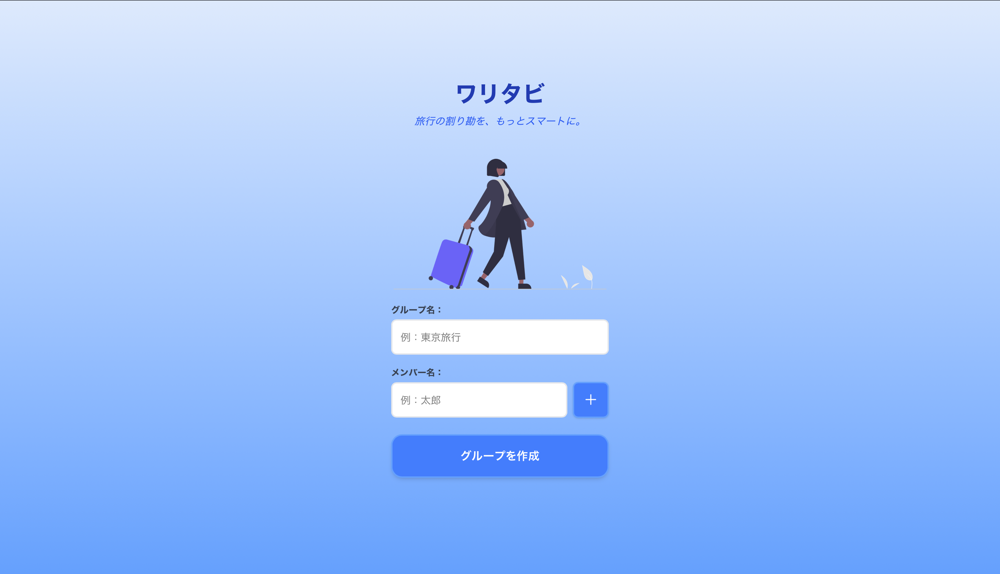
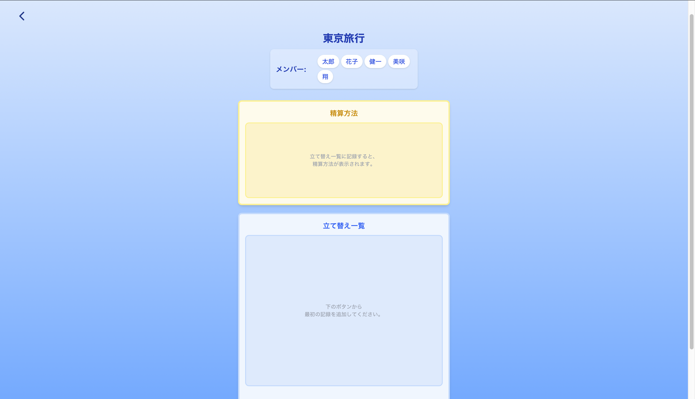
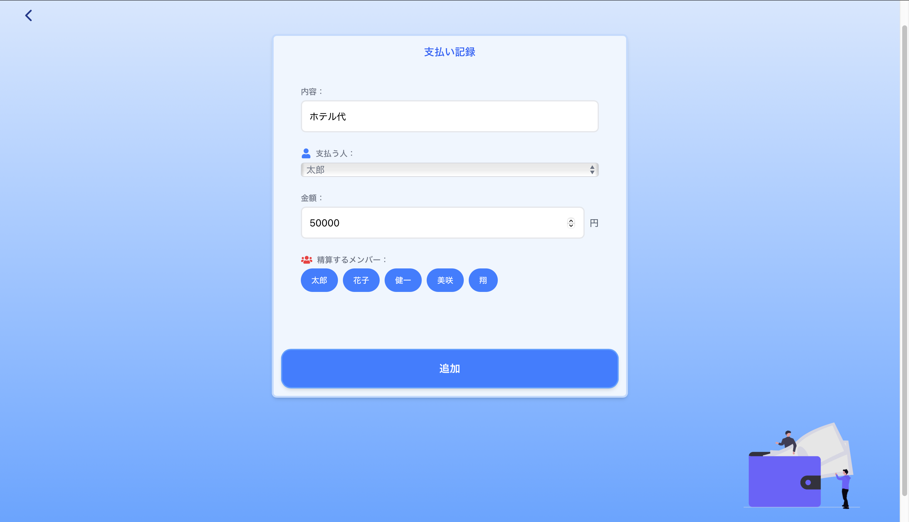
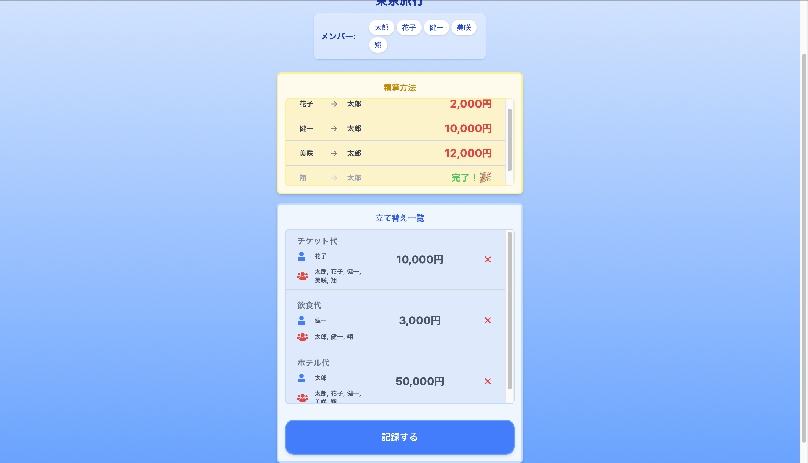
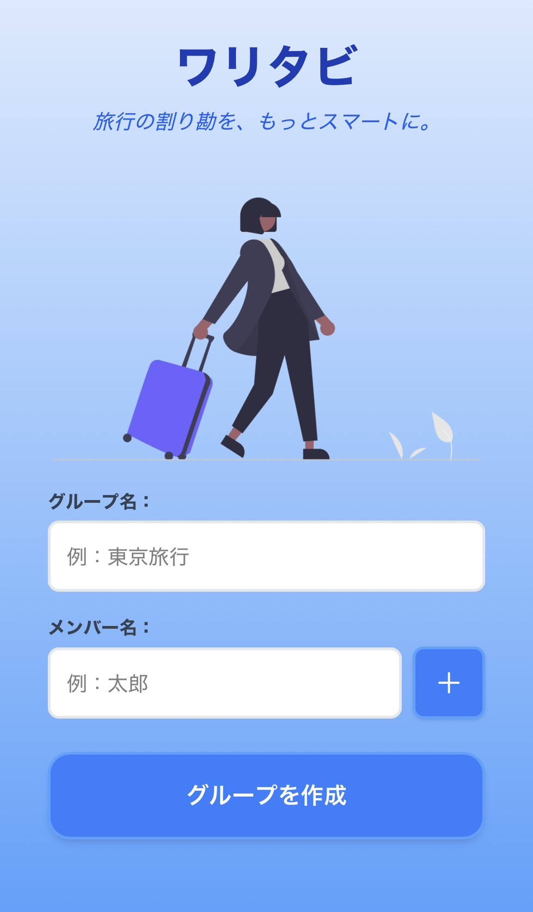
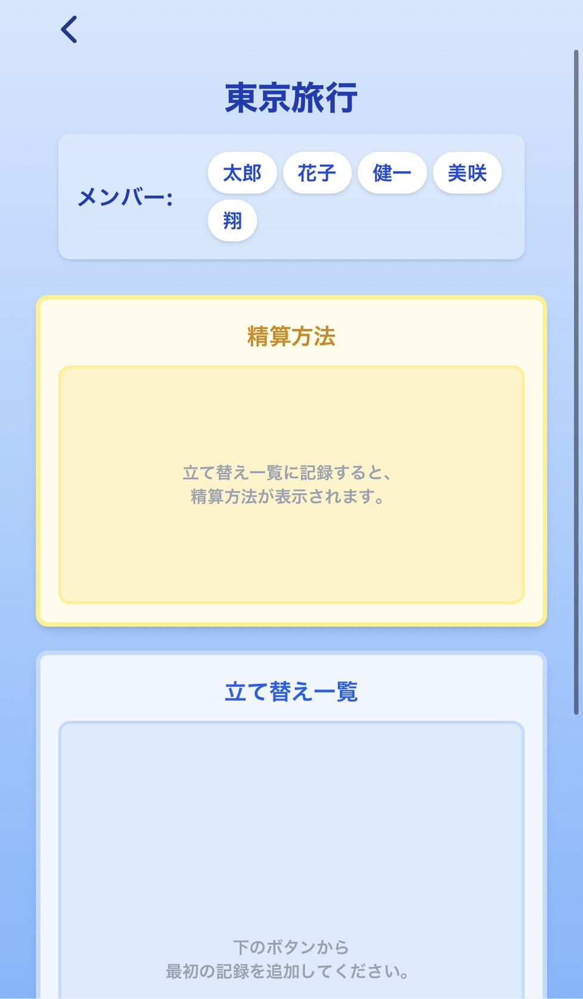
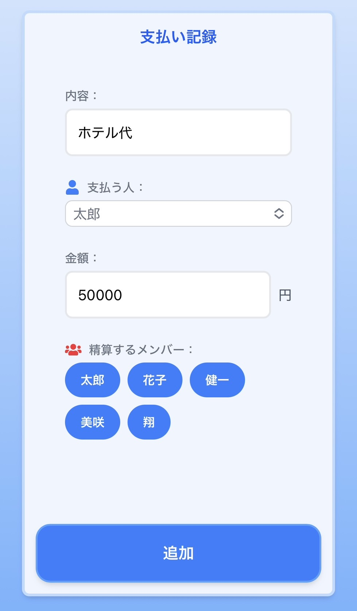
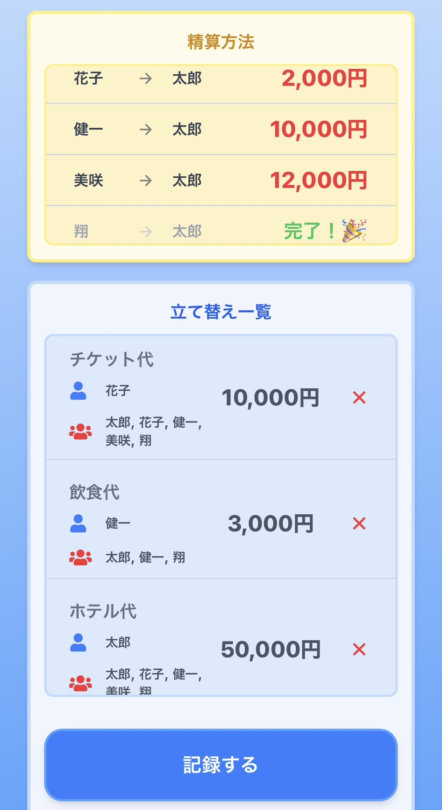

### [アプリのURLはこちら](https://waritabi.vercel.app)
# 1.アプリ名

「ワリタビ」 – シンプルで便利な旅行割り勘アプリ

# 2.概要

旅行やイベントなど、グループでの立て替えや支払いを手軽に管理・精算できるウェブアプリです。誰がいくら支払ったのか、誰が誰にいくら返すべきなのかを自動で計算し、旅行後の面倒な精算作業をシンプルにします。
フレームワークは Next.js を使用し、個人開発で取り組みました。

# 3.使用技術

### フレームワーク・言語

- Next.js
- React
- TypeScript

### スタイリング

- Tailwind CSS

### 状態管理

- React Context API

### 共有データ

- Supabase（PostgreSQL / Anonymous Auth / Realtime / Row Level Security）
- Cloudflare Turnstile

# 4.主な機能

- グループ作成時のメンバー登録（作成後の構成は固定）
- 支払い情報の追加（何を、誰が、誰の分を、いくら支払ったかを登録）
- 各メンバーの合計支出額の表示
- 割り勘計算機能（誰が誰にいくら支払うべきかを自動計算）
- 招待リンクによる匿名参加とリアルタイム共同編集
- 支払い記録の編集・削除
- 精算送金の記録と取り消し
- この端末で最後に開いた共有グループへの再訪
- レスポンシブデザインによるスマートフォン・PC 対応

グループ作成後はグループ名の変更と、メンバーの追加・改名・削除はできません。参加者は「あなたのメンバー」の紐づけだけを後から変更できます。

`localStorage`には匿名認証セッション、作成者用の招待トークン、直近グループ1件のIDと名前だけを保存します。グループ本体の正式データはSupabaseにあり、IndexedDBには最後に検証できたスナップショット、入力下書き、未同期の新規支払いのみを保存します。これらはブラウザに削除される可能性があり、バックアップとしては扱いません。共同編集対応前の旧端末データはホーム表示時に削除されます。

# 5.ローカル開発

## Supabaseの準備

1. Supabaseプロジェクトで匿名サインインを有効にします。
2. Cloudflare Turnstileを作成し、Supabaseの「Bot and Abuse Protection」で同じSecret keyを設定します。
3. Supabase CLIでプロジェクトをリンクし、マイグレーションを適用します。

```bash
npx supabase login
npx supabase link --project-ref <PROJECT_REF>
npx supabase db push
```

`.env.example`を`.env.local`へコピーし、SupabaseのURL、Publishable key、TurnstileのSite keyを設定します。Service role keyやTurnstileのSecret keyはブラウザ用環境変数へ設定しないでください。

```bash
npm install
npm run dev
```

ローカルSupabaseとDBテストを利用する場合はDockerを起動してから実行します。

```bash
npx supabase start
npx supabase db reset
npm run test:db
```

通常の検証コマンドは次のとおりです。

```bash
npm test
npm run lint
npx tsc --noEmit --incremental false
npm run build
```

# 6.ファイル構成

```
src/
├── app/(main)/
│   ├── groups/[groupId]/        # 共有グループ・支払い追加・編集
│   ├── join/[token]/            # 招待リンク参加
│   └── page.tsx                 # 新規作成・直近グループ
├── components/features/
│   ├── auth/                    # 匿名認証とTurnstile
│   ├── add_payment/             # 新規・編集共通フォーム
│   ├── group/                   # 記録・精算・共有設定
│   └── home/                    # グループ作成
├── contexts/
│   └── GroupContext.tsx
├── lib/                        # 計算・通信・実行時検証
└── types/
    └── index.ts
supabase/
├── migrations/                 # テーブル・RLS・RPC・Realtime設定
└── tests/                      # pgTAPによるDB権限・競合テスト
```

# 7.工夫した点、課題解決

### [トランザクションとrevisionによる安全な共同編集]

#### 背景・課題

支払いと参加者は複数テーブルにまたがるため、テーブルごとのRealtime更新では一時的な不整合を表示する可能性があります。また、同じ支払いを複数人が同時に編集する競合も扱う必要があります。

#### 解決策

DB更新は検証付きRPC内でトランザクション実行し、更新ごとにグループの`revision`を増やします。クライアントはグループ行だけを購読し、revision変更後にスナップショット全体を再取得します。支払いには行versionを持たせ、古い画面からの更新を競合として拒否します。

#### 成果

複数テーブルの中間状態を表示せず、同時編集時も他の人の変更を上書きせずに最新状態へ復帰できる構成になりました。

### [ユーザー体験（UX）を考慮した機能の実装]

#### 背景・課題

アプリケーション開発において、機能性だけでなく、ユーザーが直感的で快適に操作できる体験を提供することが重要です。特に、データ入力中に意図せずページを離れてしまったり、入力必須の項目が分からなかったりすると、ユーザーはストレスを感じ、アプリの利用を中断してしまう可能性があります。

#### 解決策

Supabaseへの接続が長引く場合は、最後に検証できた端末データで続けられます。キャッシュ中の既存データは閲覧専用とし、新規支払いだけを未同期として端末へ保存します。再接続時は操作IDにより二重登録を防ぎながら自動同期し、最新状態を再取得します。また、支払いと精算取り消しには確認を表示し、失敗理由を日本語で案内します。

#### 成果

通信状態と競合を画面で判別でき、データの二重登録や意図しない上書きを避けながら共同編集できるようになりました。


# 8.スクリーンショット





<p align="center">
  
  
</p>


<p align="center">
  
  
</p>


# 9.まとめ

本アプリ「ワリタビ」は、グループでの精算をスムーズにすることを目指して開発しました。Next.js と TypeScript を用いた開発を通じて、フロントエンド開発のスキルを実践的に深めることができました。特に、Context API による状態管理や、型安全を意識した開発の重要性を学びました。
今後は、複数外貨での割り勘機能などを追加し、より実用的なアプリケーションへと改善していく予定です。
