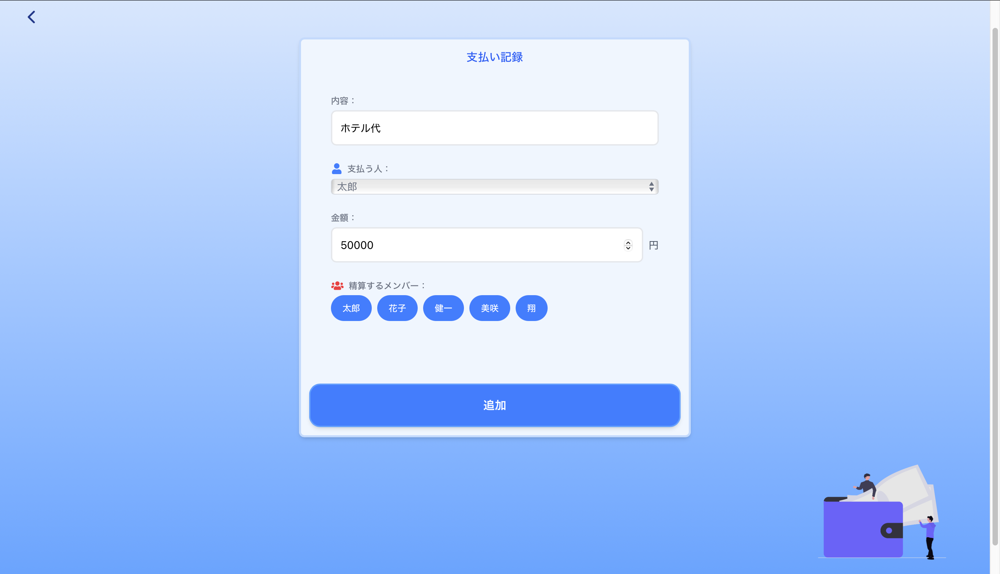

# 1.アプリ名

「ワリタビ」 – シンプルで便利な旅行割り勘アプリ

# 2.概要

旅行やイベントなど、グループでの立て替えや支払いを手軽に管理・精算できるウェブアプリです。誰がいくら支払ったのか、誰が誰にいくら返すべきなのかを自動で計算し、旅行後の面倒な精算作業をシンプルにします。
フレームワークは Next.js を使用し、個人開発で取り組みました。

# 3.使用技術

### フレームワーク・言語

- Next.js
- React
- TypeScript

### スタイリング

- Tailwind CSS

### 状態管理

- React Context API

### React 構文

- React Hooks（useState, useContext, useEffect）

# 4.主な機能

- グループメンバーの登録
- 支払い情報の追加（何を、誰が、誰の分を、いくら支払ったかを登録）
- 各メンバーの合計支出額の表示
- 割り勘計算機能（誰が誰にいくら支払うべきかを自動計算）
- レスポンシブデザインによるスマートフォン・PC 対応

# 5.工夫した点、課題解決

### [React Context API による効率的な状態管理]

#### 背景・課題

複数のコンポーネント（メンバーリスト、グループ名、精算結果表示など）でグループ情報や支払い情報を共有する必要がありました。props を介したデータを複数のコンポーネントで受け渡すのは、構造が複雑になるにつれて管理が煩雑になり、コードの見通しが悪くなる懸念がありました。

#### 解決策

React Context API を導入し、グループメンバーや支払いリストといったグローバルな状態を一元管理する`GroupContext`を作成しました。これにより、アプリケーション内のどのコンポーネントからでも必要なデータに直接アクセスし、更新できるようになりました。

```tsx
// src/contexts/GroupContext.tsx
export const GroupProvider = ({ children }: { children: React.ReactNode }) => {
  const [members, setMembers] = useState<Member[]>([]);
  const [payments, setPayments] = useState<Payment[]>([]);
  // ...
  return (
    <GroupContext.Provider
      value={{ members, payments, addMember, addPayment /* ... */ }}
    >
      {children}
    </GroupContext.Provider>
  );
};
```

#### 成果

props を複数のコンポーネント間で次々に受け渡していくことを回避し、コンポーネント間の依存関係を保つことができました。結果として、コードの可読性と保守性が向上し、機能追加やデバッグが容易になりました。

### [ユーザー体験（UX）を考慮した機能の実装]

#### 背景・課題

アプリケーション開発において、機能性だけでなく、ユーザーが直感的で快適に操作できる体験を提供することが重要です。特に、データ入力中に意図せずページを離れてしまったり、入力必須の項目が分からなかったりすると、ユーザーはストレスを感じ、アプリの利用を中断してしまう可能性があります。

#### 解決策

ユーザーの誤操作を防ぎ、快適な利用を促すために、以下のような UX 向上のための機能を複数実装しました。

1.  **入力データの保護:** 意図しないデータ消失を防ぐため、ホーム画面へ戻る際には確認アラートを表示します。さらに、入力中のグループ情報や支払いデータを非同期ストレージに一時保存することで、ユーザーが誤ってページを離れたりアプリを閉じたりした場合でも、作業内容が失われないようにしました。
2.  **丁寧な入力フォームの誘導:** テキストボックスが空のまま操作を進めようとした際に、エラーメッセージを表示するだけでなく、どの項目を入力すべきか分かりやすく示すことで、ユーザーを丁寧に案内します。
3.  **操作完了を知らせる演出:** 精算ボタンを押した際にクラッカーが弾けるアニメーションを追加しました。これにより、精算が正常に完了したことを視覚的に楽しく伝え、アプリ利用の満足度を高める工夫をしました。

#### 成果

これらの細やかな機能改善により、ユーザーは安心して楽しくアプリを操作できるようになりました。入力ミスやデータの意図しない消失といったストレスが軽減され、より直感的で楽しいユーザー体験を提供することができました。結果として、アプリケーション全体の使いやすさと満足度が向上しました。

#### 成果

計算の信頼性が向上し、エラーリスクが大幅に減少しました。また、型の定義により、他の開発者や将来の自分がコードを理解しやすくなるというメリットも生まれました。

# 6.スクリーンショット




<p align="center">
  
  
</p>


<p align="center">
  
  
</p>


# 7.まとめ

本アプリ「ワリタビ」は、グループでの精算をスムーズにすることを目指して開発しました。Next.js と TypeScript を用いた開発を通じて、フロントエンド開発のスキルを実践的に深めることができました。特に、Context API による状態管理や、型安全を意識した開発の重要性を学びました。
今後は、複数外貨での割り勘機能や、グループ共有機能などを追加し、より実用的なアプリケーションへと改善していく予定です。
